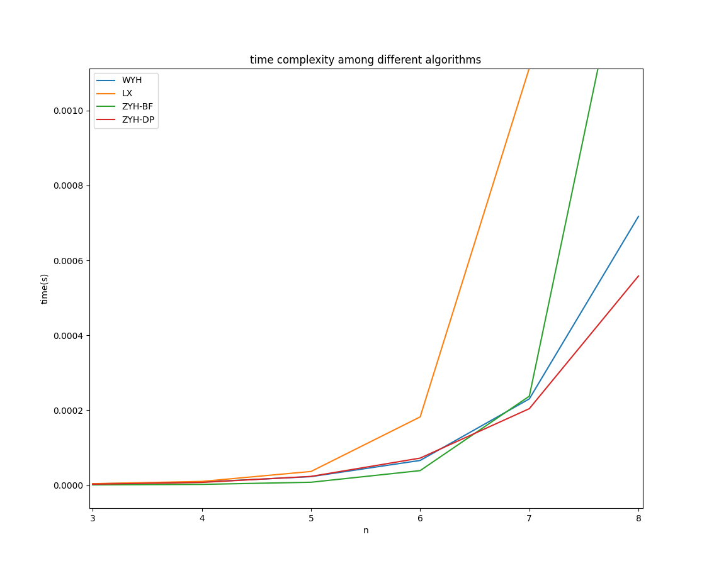
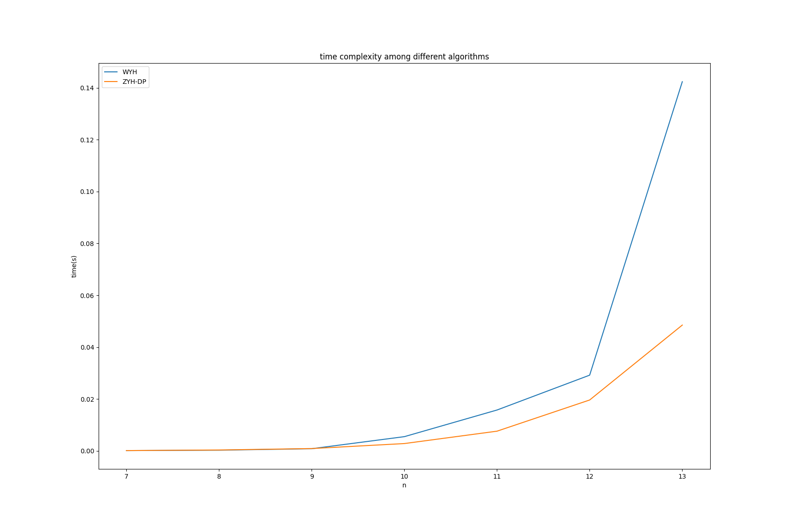
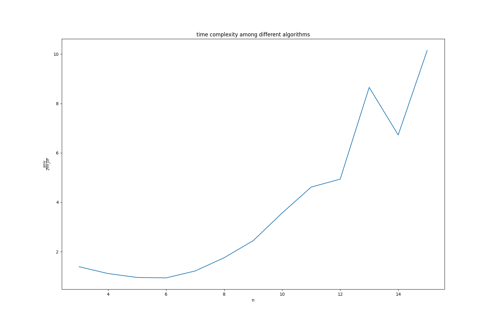

## 四、程序实现和实验测试过程

### 1 验证算法的正确性

我们搜集了用python语言解决该题并通过洛谷对应测试的四种实现，分别封装成提供数据规模`n:int`和距离表`time_map:list[list[int]]`，返回最短路程长度的函数：

```python
def solve(n:int, time_map:list[list[int]]) -> int:
    ...
```

我们实现了一个测试点生成器，用于产生不同**数据规模**`n`、不同**连通率**`ratio`的邻接矩阵：

```python
from random import randrange

def generate_testcase(n, ratio=1) -> list[list[int]]:
    MAX = _MAX // n
    time_map = [[-1] * n for _ in range(n)]

    while True:
        for i in range(n):
            time_map[i][i] = 0

        for i, j in combinations(range(n), 2):
            time_map[i][j] = time_map[j][i] = randrange(MAX)

        for _ in range(int(n * n * (1 - ratio))):
            while True:
                i, j = randrange(n), randrange(n)
                if i != j and time_map[i][j] != -1:
                    time_map[i][j] = -1
                    break
        
        if check_connect(time_map):
            return time_map
```

其中`check_connect`是检测图是否连通的函数，它确保`generate_testcase`生成的测试点数据是合理的。

我们在各种大小的地图中，始终确保四个算法的返回值相同。

```python
from solutions.wyh_solution import solve as solve_0
from solutions.lx_solution import solve as solve_1
from solutions.BF_solution import solve as solve_2
from solutions.DP_solution import solve as solve_3

args = n, time_map = ...
assert solve_0(*args) == solve_1(*args) == solve_2(*args) == solve_3(*args)
```

在运行了数十亿次不同的`testcase`中，该断言从未报错，证明四个算法的结果一致，算法正确性得证。

### 2 对于给定的输入，比较同类算法的性能

我们主要关注时间复杂度与数据规模`n`的关系。

```python
def run(func, *args, n=10_000) -> float:
    t = time()
    for _ in range(n):
        func(*args)
    return time() - t
```

`run`函数统计`func`重复运行同一个测试点`n`次的耗时。

```python
def do_test(size, ratio, m=100, n=100):
    cases = [
        generate_testcase(size, ratio)
        for _ in range(m)
    ]

    return [
        sum(run_1(func, size, case, n=n) for case in cases) / (m * n)
        for func in (solve_0, solve_1, solve_2, solve_3)
    ]
```

`do_test`函数统计**四个函数**分别跑`m`个测试点每个`n`次的**平均单次耗时**。

实际代码还包含一些作图用的脚本，以及一些debug用的助手函数。

---

四个函数中，`BF_solution.py`和`lx_solution.py`实现的是**遍历全排列**；`wyh_solution.py`是标准的**深度优先搜索**；`DP_solution.py`是一种崭新的基于**动态规划**思想的途径。下面先定性分析以上四种算法在不同数据规模`n`下的平均运行时间。

---

固定`ratio=0.9`，令`n`遍历3到8，比较四种算法耗费的时间，结果作图如下：



固定`ratio=1`，令`n`遍历7到13，比较较快两算法耗费的时间，结果作图如下：



1. 在数据量较小时，暴力解法虽然在复杂度上高于深度优先搜索的算法，但是由于其优秀的常数项而得占优势，优势在`n<7`时得以保持
2. 在数据量较大时，动态规划解法的优势才得以展现。从下图中可以看出，动态规划法的时间复杂度的阶数与深度优先搜索法的阶数有不同



### 3 定量分析

将测试数据序列化保存：

```python
import pickle

def run_and_save_result():
    x, y_0, y_1, y_2, y_3 = zip(
        *((size, *do_test_1(size, 1, 20, 20)) for size in range(3, 10))
    )
    limit = min(map(len, (x, y_0, y_1, y_2, y_3)))
    pickle.dump((
        (x[:limit], y_0[:limit], y_1[:limit], y_2[:limit], y_3[:limit])
    ), open("out.pkl", "wb"))
```

得到`out.pkl`，包含5行7列的测试结果。以下测试第一步均为读取数据：

```python
import pickle
x, y_0, y_1, y_2, y_3 = pickle.load(open("out.pkl", "rb"))
```

#### 3.1 比率测试

.svg)

曲线有收敛于常数的趋势，这表明O(n!)的时间复杂度是有合理的。

#### 3.2 幂测试

.svg)

显然，对数变换后仍然不能看成直线，而是下凸的曲线，这表明算法的时间复杂度是超多项式的。

---

### 附录

###### wyh_solution.py

```python
def solve(n, time_map):
    best_path = [0]
    minimum_cost = pow(2, 31)

    def dfs(path, order, cost):
        nonlocal minimum_cost
        path.append(order)

        if len(path) == n:
            if cost < minimum_cost:
                best_path[-1] = path
                minimum_cost = cost
            return

        for i in range(n):
            if time_map[order][i] != -1 and i not in path and cost + time_map[order][i] < minimum_cost:
                cost += time_map[order][i]
                dfs(path.copy(), i, cost)
                cost -= time_map[order][i]

    dfs([], 0, 0)
    
    return minimum_cost


if __name__ == '__main__':
    n = int(input())
    print(solve(n, [[int(i) for i in input().split()] for _ in range(n)]))
```

###### lx_solution.py

```python
def solve(n, time_map):
    sumCost = pow(2, 31)

    def compare(numList):
        sum_ = 0
        nonlocal sumCost, time_map
        for i in range(len(numList) - 1):
            x = numList[i]
            y = numList[i + 1]
            if time_map[x][y] == -1:
                return -1
            sum_ += time_map[x][y]
        if sum_ < sumCost:
            sumCost = sum_

    def perm(numList, start, end):
        if start == end:
            compare(numList)
        else:
            for i in range(start, end):
                numList[start], numList[i] = numList[i], numList[start]
                perm(numList, start + 1, end)
                numList[start], numList[i] = numList[i], numList[start]

    nums = [i for i in range(n)]
    perm(nums, 1, n)

    return sumCost


if __name__ == '__main__':
    n = int(input())
    print(solve(n, [[int(i) for i in input().split()] for _ in range(n)]))
```

###### BF_solution.py

```python
from itertools import permutations


def solve(n, time_map):
    ans = 0b1 << 31

    for path in permutations(range(1, n), n - 1):
        this = i = 0
        for j in path:
            time = time_map[i][j]
            if time == -1:
                break
            this += time
            i = j
            if this >= ans:
                break
        else:
            ans = this

    return ans


if __name__ == '__main__':
    n = int(input())
    print(solve(n, [[int(i) for i in input().split()] for _ in range(n)]))
```

###### DP_solution.py

```python
def solve(n, time_map):
    past = {(0b1, 0): 0}  # (path, last) -> time
    for _ in range(n - 1):
        this = {}
        for key, spent in past.items():
            visited, last = key

            for i in range(1, n):
                if not visited & 0b1 << i:
                    time = time_map[last][i]
                    if time == -1:
                        continue

                    val = spent + time
                    key = visited | 0b1 << i, i
                    if key not in this or this[key] > val:
                        this[key] = val
        past = this

    return min(past.values())


if __name__ == '__main__':
    n = int(input())
    print(solve(n, [[int(i) for i in input().split()] for _ in range(n)]))
```

