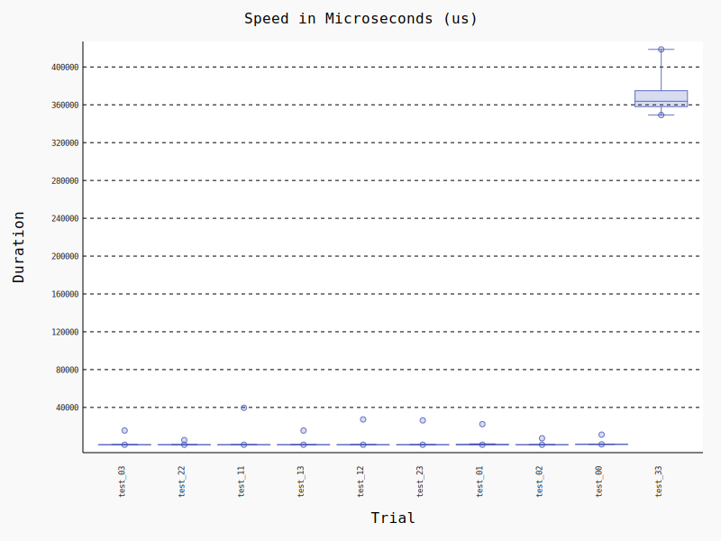
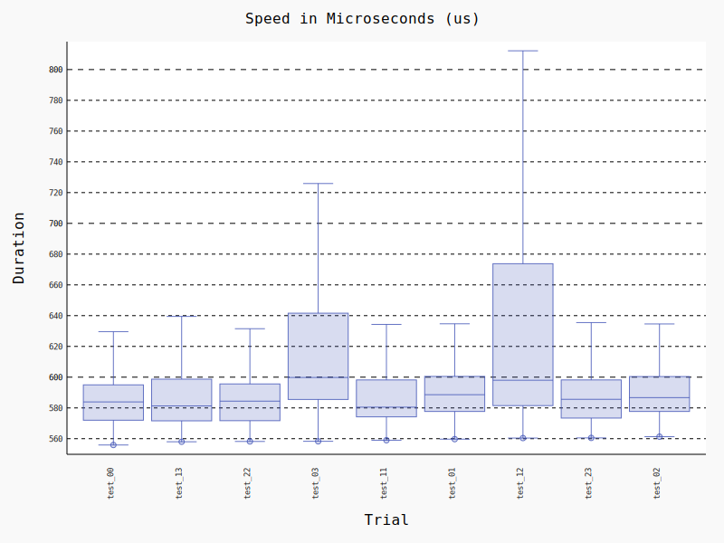

# 算法设计与分析报告

> 实验名称：U205602 骑士周游列国问题

## 问题陈述

在大小为`size * size`的方形网格中，每个格点都有`visited`和`default`两个状态。一🐎从`start:tuple[int,int]`点出发，按“日字”走，只可以走状态为`default`的点，每次走之前将当前格点状态赋为`visited`，直到所有点都为`visited`结束。

## 算法设计

获得`(x,y)`的日字邻域：

```python
def neighbor(x, y):
    return [(x-1, y-2), (x+1, y-2), (x-1, y+2), (x+1, y+2), (x-2, y-1), (x+2, y-1), (x-2, y+1), (x+2, y+1)]
```

判定是否`(x,y)`在网格上：

```python
size = 8
def valid(x, y):
    return 0 <= x < size and 0 <= y < size
```

提供已走过的点的集合`visited:set[tuple[int,int]]`，统计`(x,y)`周围可走的点的个数：

```python
def count(visited, x, y):
    return sum((xx, yy) not in visited and valid(xx, yy) for xx, yy in neighbor(x, y))
```

当上一步为`(x,y)`时，按**可走的点的数量**排序，优先走**可走的点少**的点。于是构造**排好序的列表**的函数：

```python
def find_bests(visited, x, y) -> list[tuple[int,int,int]]:
    return sorted(((count(visited, xx, yy), xx, yy) for xx, yy in neighbor(x, y) if (xx, yy) not in visited and valid(xx, yy)))
```

需要注意的是，返回值包含3个数，其中后两个代表坐标`x,y`另一个是为了方便按字典序排序而加入的**个数**值。

---

主函数采用深度优先搜索，返回**从这个点到末尾的路径的列表**或`None`表示**此路不通**。具体实现如下：

```python
def travel(visited, x, y):
    if len(visited) == size * size:
        return [(x, y)]
    for _, xx, yy in find_bests(visited, x, y):
        result = travel(visited | {(xx, yy)}, xx, yy)
        if result:
            return [(x, y)] + result
```

最后，读取题目输入并按要求输出路径：

```python
if __name__ == '__main__':
    x, y = map(int, input().split())
    world = [[0] * size for _ in range(size)]
    step = 0
    for i, j in travel({(x, y)}, x, y):
        step += 1
        world[i][j] = step
    else:
        print(*(' '.join(map(str, row)) for row in world), sep='\n')
```

## 时间空间复杂度分析

- 问题规模n为棋盘的格点数
- 最好情况下，不用回溯就能走完全程，时间复杂度为$O(n)$
- 最坏情况下，也不会超过$8^{n}$种选择，因此时间复杂度为$O(8^{n})$
- 实测发现几乎不需要回溯，即平均时间复杂度基本上也是$O(n)$

- 空间复杂度始终为递归深度，即$O(n)$

## 程序实现和实验测试

实用`pytest-benchmark`框架进行测试（每个函数约30万次，其中20次为一组），其中`test_xy`指的是起始点为`(x,y)`的情况



似乎只有当初始点为`(3,3)`时触发了回溯，其他情况分布较为平均，但以`(0,3)`和`(1,2)`为起始点的情况的耗时方差较大



#### 总结

本文讨论了一种朴素的贪心算法来解决骑士巡游问题，并从理论和实测的角度对它进行了复杂度分析。